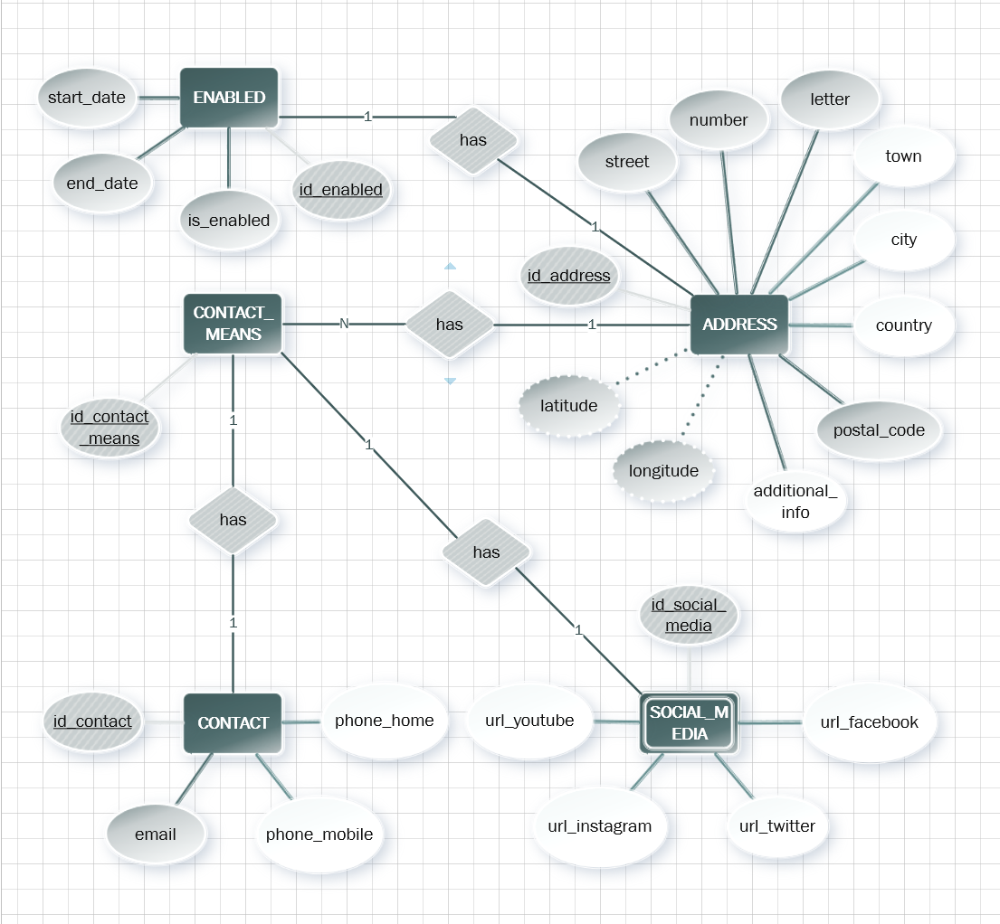

# Micro Contact_Means ([sdjr2--rest_contact_means--sb](https://github.com/JacintoRR396/sdjr2--rest_contact_means--sb))

## 📖 Description of your project
Microservice charges of managing the means of contacts for another micro orchestrator, some are : 
**contact**, **address**, **social media**, etc.

## 🛠️ Project functionalities
- `Manage everything related to an address`: Some important information is the street, number, postal code, tc..
- `Manage everything related to means of contact`: some means of contact are mobile phone, home phone and email.
- `Manage everything related to socials media`: some social networks are facebook, twitter, instagram and youtube.

## 🔧 How users can use it
### 📁 Project access
- Access the [GitHub repository](https://github.com/JacintoRR396/sdjr2-rest_contact_means-sb) and you can **download** or **clone** it.

### 🚩 Open and run the project
- Open your favorite IDE and import it as a new maven project.
- Do a mvn clean install -U.
- Run the project in your desired port.

## 💻 Used technology
* **Platform:** Java 17
* **Project type:** Microservice
* **Spring Boot version:** 3.2.0.RELEASE
* **Deployment platform:** Openshift OCP4
* **Others:**
    * Kafka Event Hub
    * Batch

## 👥 Project authors
[ Jacinto Roldán Rodríguez](https://github.com/JacintoRR396)
